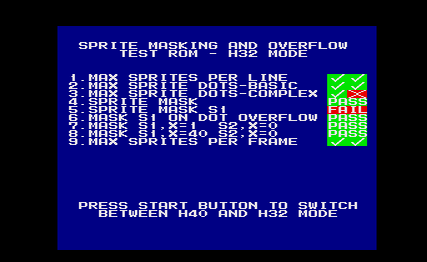

## VDPSIM - fpgagen vdp simulation for ghdl

This setup runs the VDP from the fpgagen genesis implementation in a
[GHDL](http://ghdl.free.fr/) simulation.

Furthermore avconv from the libav-tools is needed as well as convert from
imagemagick to process the binary output of the video simulation into a png image.

A virtual vram and a virtual video device are provided allowing to render
the display directly from a vram image to a png image as depicted below:

This test runs the VRAM image from the 
[Sprite_Masking_and_Overflow_Test_ROM](https://segaretro.org/Sprite_Masking_and_Overflow_Test_ROM).

Run '''make view''' to re-generate above screenshot. This takes some time as the
simulation needs to run for full two frames as the vdp needs one full frame
before it actually starts rendering.

Other targets exist for wave file generation and viewing.
